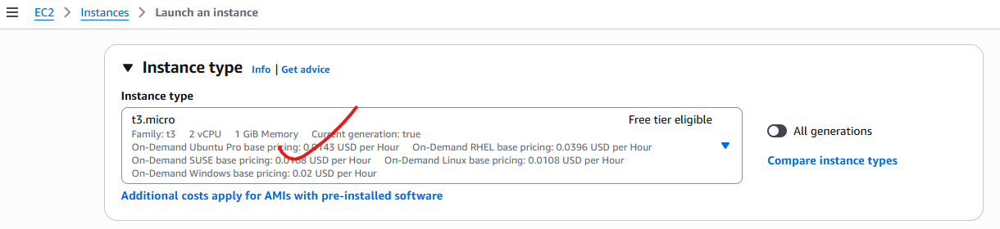
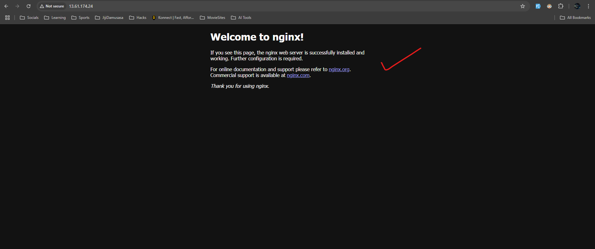
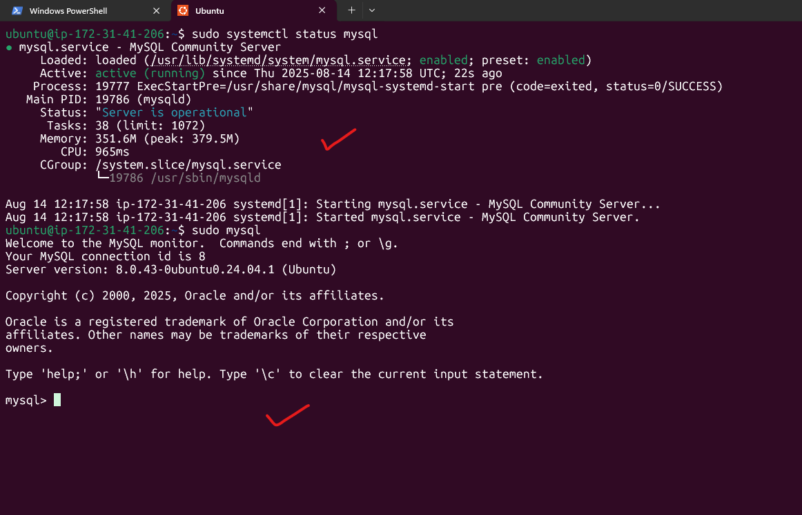

# LEMP Stack Implementation on AWS

## Overview
The **LEMP stack** is a web service solution stack consisting of:
- **L**inux – Operating system
- **N**ginx – Web server
- **M**ySQL/MariaDB – Database
- **P**HP – Scripting language

We will deploy the LEMP stack on an Amazon EC2 instance running Ubuntu.

---

## 1. Prerequisites
Before starting, ensure you have:
1. An **AWS Account**.
2. Basic knowledge of **Linux commands**.
3. A **key pair** for SSH access.
4. AWS **security group rules** allowing:
   - HTTP (Port 80)
   - SSH (Port 22)
5. A local terminal (Linux/Mac/git bash) or **PuTTY** (Windows).

---

## 2. Step-by-Step Implementation

### Step 1: Launch an EC2 Instance
- Log into the AWS Management Console to setup the EC2 Instance.
---
- Enter the name of your web server
---

---
- Choose **Ubuntu Server 22.04 LTS** (or latest version).
---

- Select an **instance type** (e.g., t2.micro for free tier).
---

---
- Launch and download the `.pem` key pair or use an already created key pair.
---

---
- Configure **Security Group** to allow HTTP, HTTPS, SSH.
---

---
- Configure the storage to what you prefer but we will leave everything default.
---

---
- Scroll down and at your right, click on Launch Instance.
---
- You should see this if everything is successful
---

---
- Make sure the status checks are all checked ensuring that our instance has been launched and running
---

---
- Now, copy the public IP Address of your instance
---

---
- Another way to retrieve your IP Address is to use this command
```bash
 TOKEN=`curl -X PUT "http://169.254.169.254/latest/api/token" -H "X-aws-ec2-metadata-token-ttl-seconds: 21600"` && curl -H "X-aws-ec2-metadata-token: $TOKEN" -s http://169.254.169.254/latest/meta-data/public-ipv4
```
### Step 2: Connect to Your Instance
From your terminal, cd Downloads/:
```bash
chmod 400 lemp-stack-kp.pem
ssh -i lemp-stack-kp.pem ubuntu@<EC2_PUBLIC_IP>
```
- You're in when you see this
---

---

### Step 3: Update the System
```bash
sudo apt update && sudo apt upgrade -y
```

---

### Step 4: Install Nginx Web Server
```bash
sudo apt install nginx -y
```
Enable and start Nginx:
```bash
sudo systemctl enable nginx
sudo systemctl start nginx
```
---
Check the status of Nginx. If it's green, it means you did everything well
```bash
sudo systemctl status nginx
```
- You should see this if everything is well
---

---
- Test: Visit `http://<EC2_PUBLIC_IP>` in your browser.
---

---
- Test: You can also test in your terminal with these commands
```bash
curl http://localhost:80 
```
or
```bash
curl http://127.0.0.1:80
```

### Step 5: Installing MySQL
```bash
sudo apt install mysql-server -y
```
Verify MySQL:
```bash
sudo systemctl status mysql
```
Log into mysql by typing this command
```bash
sudo mysql
```
- You will see this:
---

---
Set a password for root user using mysql_native_password as default authentication method:
```bash
ALTER USER 'root'@'localhost' IDENTIFIED WITH mysql_native_password BY 'PassWord.1'; 
```
Exit the MySQL shell with:
```bash
exit
```
Start the interactive script:
```bash
sudo mysql_secure_installation
```
- This will ask if you want to configure the `VALIDATE PASSWORD PLUGIN`, type y. If you answer y, you'll be asked to select a level of password validation :
---

---

---
Test if you're able to log in by typing:
```bash
sudo mysql -p
```
NB: -p flag will prompt you for the password used after changing the root user password.
To exit the MySQL console, type:
```bash
exit
```


---

### Step 6: Install PHP
```bash
sudo apt install php-fpm php-mysql -y
```
Check PHP version:
```bash
php -v
```

---

### Step 7: Create a Virtual Host for your website using Nginx
Create a directory for your website using `mkdir`. In our case:
```bash
sudo mkdir /var/www/projectLEMP
```
Assign ownership of directory to `$USER` environment variable, references your current system user:
```bash
sudo chown -R $USER:$USER /var/www/projectLEMP
```
Create and open a new configuration file in Nginx's `sites-available` directory:
```bash
sudo nano /etc/nginx/sites-available/projectLEMP
```

Add the following configuration:
```nginx
server {
    listen 80;
    server_name projectLEMP www.projectLEMP;
    root /var/www/projectLEMP;
    index index.html index.htm index.php;

    location / {
        try_files $uri $uri/ =404;
    }

    location ~ \.php$ {
        include snippets/fastcgi-php.conf;
        fastcgi_pass unix:/var/run/php/php8.1-fpm.sock;
    }

    location ~ /\.ht {
        deny all;
    }
}
```

To enable the new virtual host, create a symbolic link:
```bash
sudo ln -s /etc/nginx/sites-available/projectLEMP /etc/nginx/sites-enabled/
```

To disable the default website that comes with Nginx, remove the symbolic link:
```bash
sudo rm /etc/nginx/sites-enabled/default
```

To make sure your configuration file doesn't contain syntax errors, run:
```bash
sudo nginx -t
```

Reload Nginx so these changes take effect:
```bash
sudo systemctl reload nginx
```

### Step 8: Test PHP Processing
Create a test file for your empty web root:
```bash
sudo echo 'Hello LEMP from hostname' $(TOKEN=`curl -X PUT "http://169.254.169.254/latest/api/token" -H "X-aws-ec2-metadata-token-ttl-seconds: 21600"` && curl -H "X-aws-ec2-metadata-token: $TOKEN" -s http://169.254.169.254/latest/meta-data/public-hostname) 'with public IP' $(TOKEN=`curl -X PUT "http://169.254.169.254/latest/api/token" -H "X-aws-ec2-metadata-token-ttl-seconds: 21600"` && curl -H "X-aws-ec2-metadata-token: $TOKEN" -s http://169.254.169.254/latest/meta-data/public-ipv4) > /var/www/projectLEMP/index.html
```

Visit:
```
http://<EC2_PUBLIC_IP>:80
```
- If you see the text from `echo` command you wrote to the index.html, then it means your Nginx Virtual host is working. 

##### Create a new file called `index.php` inside the web root:
```bash
nano /var/www/projectLEMP/index.php
```
Add this to the blank file:
```php
<?php
phpinfo();
?>
```
- Access this page in your web browser by visiting the domain name or public IP address you’ve set up in your Nginx configuration file, followed by /info.php:
```
phttp://`server_domain_or_IP`/info.php
```
- You should see this:

---

### Step 9: Firewall Configuration (If Using UFW)
```bash
sudo ufw allow OpenSSH
sudo ufw allow 'Nginx Full'
sudo ufw enable
```

---

### Step 10: Create a Test Database and Configure Access

In this step, you will create a test database with a simple "To do list" and configure access to it, so the Nginx website can query data from the database and display it.

**Note:** At the time of this writing, the native MySQL PHP library `mysqlnd` doesn't support `caching_sha2_authentication`, the default authentication method for MySQL 8. We'll need to create a new user with the `mysql_native_password` authentication method to connect to the MySQL database from PHP.

We will create a database named `example_database` and a user named `example_user`, but you can replace these names with different values.

First, connect to the MySQL console using the root account:
```bash
sudo mysql
```

To create a new database, run the following command from your MySQL console:
```sql
CREATE DATABASE `example_database`;
```

Now create a new user and grant them full privileges on the database you have just created:
```sql
CREATE USER 'example_user'@'%' IDENTIFIED WITH mysql_native_password BY 'PassWord.1';
```

**Note:** Replace `PassWord.1` with a secure password of your own choosing.

Now give this user permission over the `example_database` database:
```sql
GRANT ALL ON example_database.* TO 'example_user'@'%';
```

This will give the `example_user` full privileges over the `example_database` database, while preventing this user from creating or modifying other databases on your server.

Exit the MySQL shell:
```sql
exit
```

Test if the new user has the proper permissions by logging in to the MySQL console using the custom user credentials:
```bash
mysql -u example_user -p
```

After logging in to the MySQL console, confirm that you have access to the `example_database` database:
```sql
SHOW DATABASES;
```

You should see output similar to:
```
+--------------------+
| Database           |
+--------------------+
| example_database   |
| information_schema |
+--------------------+
2 rows in set (0.000 sec)
```

Next, create a test table named `todo_list`. From the MySQL console, run:
```sql
CREATE TABLE example_database.todo_list (
    item_id INT AUTO_INCREMENT,
    content VARCHAR(255),
    PRIMARY KEY(item_id)
);
```

Insert a few rows of content in the test table. You can repeat this command a few times with different values:
```sql
INSERT INTO example_database.todo_list (content) VALUES ("My first important item");
INSERT INTO example_database.todo_list (content) VALUES ("My second important item");
INSERT INTO example_database.todo_list (content) VALUES ("My third important item");
INSERT INTO example_database.todo_list (content) VALUES ("and this one more thing");
```

To confirm that the data was successfully saved to your table, run:
```sql
SELECT * FROM example_database.todo_list;
```

You should see output similar to:
```
+---------+--------------------------+
| item_id | content                  |
+---------+--------------------------+
|       1 | My first important item  |
|       2 | My second important item |
|       3 | My third important item  |
|       4 | and this one more thing  |
+---------+--------------------------+
4 rows in set (0.000 sec)
```

After confirming that you have valid data in your test table, exit the MySQL console:
```sql
exit
```

Now create a PHP script that will connect to MySQL and query for your content:
```bash
nano /var/www/projectLEMP/todo_list.php
```

Add the following PHP script that connects to the MySQL database and queries for the content of the `todo_list` table, displaying the results in a list:
```php
<?php
$user = "example_user";
$password = "PassWord.1";
$database = "example_database";
$table = "todo_list";

try {
  $db = new PDO("mysql:host=localhost;dbname=$database", $user, $password);
  echo "<h2>TODO</h2><ol>";
  foreach($db->query("SELECT content FROM $table") as $row) {
    echo "<li>" . $row['content'] . "</li>";
  }
  echo "</ol>";
} catch (PDOException $e) {
    print "Error!: " . $e->getMessage() . "<br/>";
    die();
}
?>
```

Save and close the file when you are done editing.

You can now access this page in your web browser by visiting your domain name or public IP address, followed by `/todo_list.php`:
```
http://<EC2_PUBLIC_IP>/todo_list.php
```

You should see a page titled "TODO" with a numbered list of the items you added to your database.

---

## 3. Troubleshooting
| Issue | Solution |
|-------|----------|
| Nginx not starting | `sudo journalctl -xe` to check logs |
| PHP file downloads instead of executing | Ensure `php-fpm` is installed and configured |
| MySQL access denied | Re-run `mysql_secure_installation` |
| Port 80 not reachable | Check AWS security group rules |
| UFW blocking traffic | Allow Nginx in UFW |

---

## 4. Cleanup
If you no longer need the setup:
- Terminate the EC2 instance from AWS Console.
- Delete associated security groups and key pairs.

---

**End of Guide**
